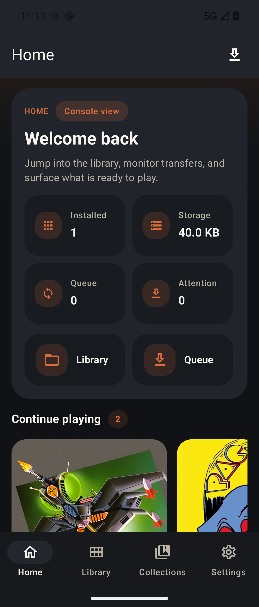
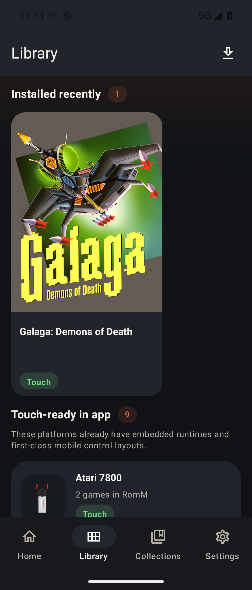
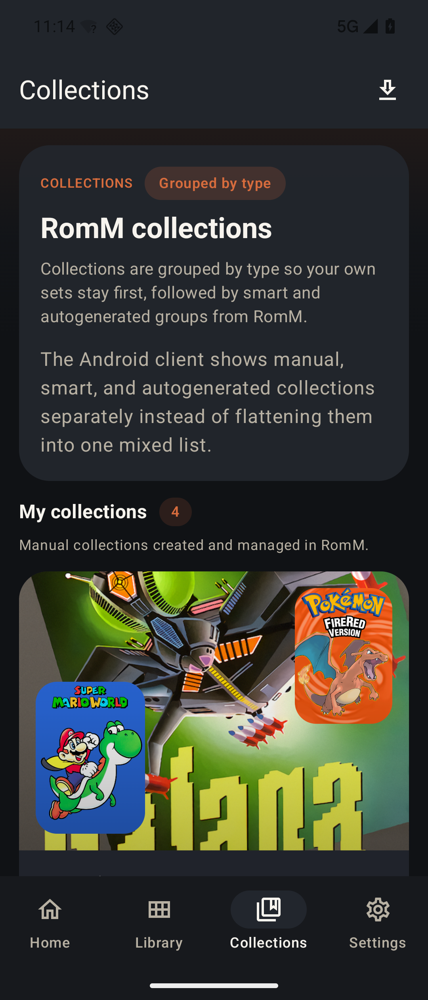
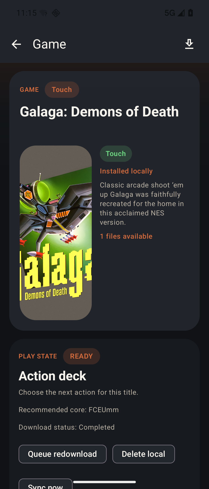

# Rommio

Rommio is a native Android companion for [RomM](https://github.com/rommapp/romm): a fast, touch-friendly client for browsing your library, downloading games, and launching supported titles with an embedded libretro player.

## Get the APK

Download the latest APK from [GitHub Releases](https://github.com/bandoracer/rommio/releases).

Rommio requires your own RomM server. It does not provide ROMs, BIOS files, or emulator cores.

## Screenshots

<table>
  <tr>
    <td></td>
    <td></td>
  </tr>
  <tr>
    <td></td>
    <td></td>
  </tr>
</table>

## Why Rommio

- Native Android shell with a real app layout instead of a wrapped web view
- Offline-first browsing once a profile has been hydrated online at least once
- Download queue management with progress, retry, cancel, and local install tracking
- Embedded libretro play for supported platform families
- Touch controls on mobile-friendly platforms and controller-first support for heavier systems
- Local storage for installs, saves, save states, profile cache data, and player preferences

## What You Need

- An Android phone or tablet running Android 8.0+ (`minSdk 26`)
- A working [RomM](https://github.com/rommapp/romm) server
- A first online session so Rommio can cache your library for offline use

Rommio is designed to complement RomM, not replace it. Server administration, library scanning, metadata enrichment, and multi-user management still live in RomM itself.

## Platform Support At A Glance

Rommio uses three support tiers in the app:

- `Touch`: embedded runtime plus first-class touch controls
- `Controller`: embedded runtime exists, but the platform is still controller-first
- `Unsupported`: browseable in RomM, but not enabled for embedded playback in Rommio

The current runtime matrix, recommended cores, and validation status live in [docs/core-matrix.md](docs/core-matrix.md).

## Offline And Player Highlights

- Browse Home, Library, Collections, platform detail, collection detail, and game detail from local cache
- Launch installed titles without a live RomM lookup when the metadata has already been hydrated
- Keep ROM downloads queued while offline and resume automatically when the network returns
- Queue save/state sync and core download work for reconnect instead of failing immediately
- Cache thumbnails for platforms, collections, and games locally so the app still feels complete offline
- Tune the player with touch layout options, OLED black mode, and optional console-inspired control colors

## Acknowledgements And Licensing

Rommio is licensed under [GPL-3.0-or-later](LICENSE).

This app is built to work with [RomM](https://github.com/rommapp/romm), which is licensed under the GNU Affero General Public License v3.0. Rommio is a separate Android client and is not a ROM source.

Rommio uses [LibretroDroid](https://github.com/Swordfish90/LibretroDroid) for embedded libretro playback. LibretroDroid is licensed under the GNU General Public License v3.0. Rommio also relies on the broader libretro ecosystem for downloadable cores. Those cores, along with any BIOS files you provide, remain separate upstream components with their own licenses and redistribution terms; they are not bundled by default with this repository or release APK.

For direct shipped dependency notices, see [THIRD_PARTY_NOTICES.md](THIRD_PARTY_NOTICES.md).

## For Developers

If you want to build, test, or release the app yourself, start with [docs/development.md](docs/development.md).

Other useful references:

- [docs/core-matrix.md](docs/core-matrix.md)
- [docs/validation-matrix.md](docs/validation-matrix.md)
- [app/](app)
- [scripts/android/](scripts/android/)
